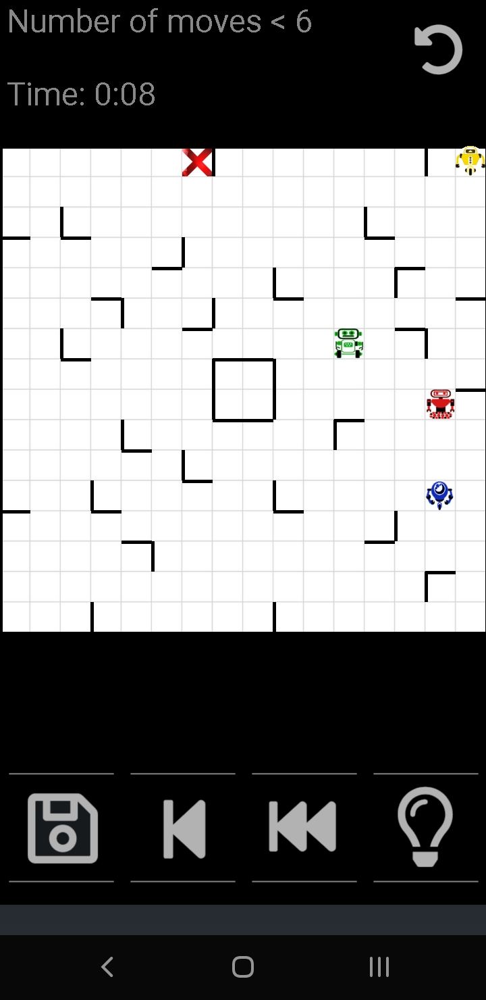

Roboyard
==========

Ein einfaches, aber herausforderndes Android-Puzzle-Spiel, inspiriert vom Brettspiel "Ricochet Robots". Es enthält eine künstliche Intelligenz, die in der Lage ist, die Rätsel zu lösen.

Sie steuern vier Roboter in einem Hof voller Hecken, die ihren Weg blockieren. Das Ziel ist es, einen bestimmten Roboter zu seinem Ziel zu führen. Die Roboter bewegen sich, bis sie entweder auf eine Hecke oder einen anderen Roboter treffen.

Die Besonderheit dieser App ist der automatische Lösungsfindungsalgorithmus, der Ihnen Hinweise und auch die optimale Lösung zeigen kann.

Roboyard ermöglicht es, bis zu 35 verschiedene Karten zu speichern. Wenn Sie also während Ihrer Spiele auf eine interessante Karte stoßen, speichern Sie sie, um sie später erneut zu spielen!

# Dokumentation

- [Bildschirmübersicht](docs/screens.md) - Detaillierte Übersicht aller Bildschirme und Navigation
- [Architektur](docs/ARCHITECTURE.md) - Technische Architektur und Komponenten
- [Mitwirken](docs/CONTRIBUTING.md) - Wie man zum Projekt beitragen kann
- [Testen](docs/TESTING.md) - Testrichtlinien und -verfahren

# App herunterladen
- Klonen Sie dieses Repository und öffnen Sie es mit Android Studio, um die App zu erstellen
- Laden Sie eine kompilierte Version aus dem [Releases-Bereich](https://github.com/Eastcoast-Laboratories/Roboyard/releases/latest) herunter
  - Mindest-Android-Version: 4.4 (KITKAT)
  - Die letzte Version für Android<4.4: Roboyard Version 10.1

# Screenshot

# Schwierigkeitsgrade
- Anfänger
  - zeigt Rätsel mit Lösungen von mindestens 4-6 Zügen
  - Ziele befinden sich immer in Ecken mit zwei Wänden
- Fortgeschritten
  - Lösungen mit mindestens 6-10 Zügen
  - drei Linien in derselben Reihe/Spalte erlaubt
  - kein mehrfarbiges Ziel
- Wahnsinnsmodus
  - Lösungen mit mindestens 10 Zügen
  - fünf Linien in derselben Reihe/Spalte erlaubt
- Unmöglicher Modus
  - Lösungen mit mindestens 17 Zügen
  - fünf Linien in derselben Reihe/Spalte erlaubt

# In Android Studio erstellen
- Stellen Sie sicher, dass Sie mindestens 2 GB freien Speicherplatz in Ihrer Home-Partition haben
- Installieren Sie Android Studio (einfach mit `sudo snap install --classic android-studio`)
- Wählen Sie am Ende der Einrichtung alle Standardeinstellungen und "Weiter" und wählen Sie dann "Projekt importieren" (Gradle)
- Wenn beim Synchronisieren des Projekts Fehler auftreten, klicken Sie auf die Links neben dem
  Fehler und akzeptieren Sie das Herunterladen der fehlenden Komponenten/Hinzufügen von Repositories und führen Sie ein Refactoring durch
