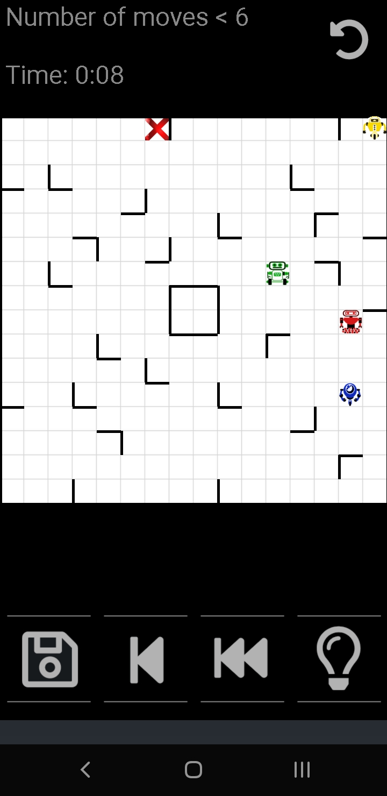

Roboyard
==========

A simple but challenging Android puzzle game inspired by the board game "Ricochet Robots ". It includes an artificial intelligence capable of solving the puzzles.

You control four robots in a yard full of hedges, that block their way. The goal is to guide a particular robot to its destination. The robots move until they either hit a hedge or another robot.

The special feature of this app is the automatic solution finding algorithm, which can show you hints and also the optimal solution.

Roboyard allows to record up to 35 different maps. So if during your games you encounter an interesting map, save it to play it later again!

# Documentation

- [How to Play](docs/HOW-TO-PLAY.md) - Instructions on how to play the game
- [Screen Overview](docs/screens.md) - Detailed overview of all screens and navigation
- [Architecture](docs/ARCHITECTURE.md) - Technical architecture and components
- [Contributing](docs/CONTRIBUTING.md) - How to contribute to the project
- [Testing](docs/TESTING.md) - Testing guidelines and procedures
- [Version Mapping](VERSION_MAPPING.md) - Mapping between versionName and versionCode for all releases

# Download App

- clone this Repository and open it with android-studio to build the app
- download a compiled version from the [Releases Section](https://github.com/Eastcoast-Laboratories/Roboyard/releases/latest)
  - minimum Android Version: 4.4 (KITKAT)
  - The last version for Android<4.4: Roboyard version 10.1

[](https://f-droid.org/packages/de.z11.roboyard/)
[](https://play.google.com/store/apps/details?id=de.z11.roboyard)

# Desktop App (Windows, macOS, Linux)

The releases also ship a desktop build, `Roboyard_v<version>_desktop.jar`. It is a
single cross-platform fat jar — the native Skiko libraries for Windows
(x64 + ARM64), macOS (x64 + ARM64) and Linux (x64 + ARM64) are bundled, so the
same jar runs on every OS.

Requirements: **Java 17 or newer** (e.g. [Eclipse Temurin](https://adoptium.net))
— check with `java -version`.

Running it — always with the `-jar` flag, on every OS:

```
java -jar Roboyard_v60_desktop.jar
```

Without `-jar`, Java interprets the path as a class name and fails with
"main class could not be found" (`ClassNotFoundException`).

- **Windows**: once a JRE is installed, double-clicking the jar works too. If
  Windows shows "A Java exception has occurred" or the jar opens as an archive
  instead, run the command above in `cmd`/PowerShell to see the real error.
- **Linux / macOS**: run the command above in a terminal, e.g.
  `java -jar ~/Downloads/Roboyard_v60_desktop.jar`.

Note: a jar built with `compose.desktop.currentOs` alone would only contain the
natives of the machine that built it and fail on any other OS with
`UnsatisfiedLinkError`. Since `composeApp/build.gradle` now bundles all Skiko
runtime artifacts, one jar covers every desktop OS.

# Supported languages

English, German (Deutsch), French (Français), Spanish (Español), Chinese (中文), Korean (한국어)

# Full accessibility

The game is fully playable for blind players and supports all accessibility features with TalkBack.

# Screenshot


# Difficulty
- Beginner
  - show any puzzles with solutions with 4-6 moves
  - targets are always in corners with two walls
- Advanced
  - solutions with 6-10 moves
  - three lines allowed in the same row/column
  - no multi-color target
- Insane mode
  - solutions with at least 10 moves
  - five lines allowed in the same row/column
- Impossible mode
  - solutions with at least 17 moves
  - five lines allowed in the same row/column


# Level Editor

Once you have completed all 140 built-in levels, a **Level Editor** will be available:

- Create your own custom levels
- Place robots, targets, and walls freely on the board
- Generate random maps with 10 different level generators
- Export and share your levels online on https://roboyard.z11.de


# Build in Android Studio
- ensure you have at least 2GB of free space in your home partition
- Install Android Studio (easy with `sudo snap install --classic android-studio`)
- choose all standard and next at the end of the setup choose to import project (Gradle)
- if you get any error while syncing the project, click on the links next to the
  error and accept to download the missing components/add repositories and do refactor
- choose build → APK from the build menu

# Licence
The solver algorithm implementation is developed at [DriftingDroids](https://github.com/smack42/DriftingDroids), which is released under **GNU GPL**. Therefore Roboyard is distributed under the same [Licence](LICENCE).

# Development
Roboyard was developed in the Project EI 4 AGI: http://perso-laris.univ-angers.fr/~projetsei4/1415/P2/index.html
- [CREDITS](CREDITS.md)

### Report
Download the report that was made for the university project:
http://perso-laris.univ-angers.fr/~projetsei4/1415/P2/documents/Bouncing_sphere.pdf

### Presentation
Download the slides used to present the project:
http://perso-laris.univ-angers.fr/~projetsei4/1415/P2/documents/Bouncing_sphere.pptx
